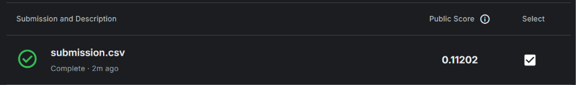

# Explanation
## This file explains the purpose and main steps performed by `solve.py`.
Purpose
- Train a classifier using `train_1.csv`, evaluate its probabilistic predictions using log-loss, and produce a submission CSV of predicted probabilities for `test_1.csv`.

Overview of main steps
- Data loading: read `train_1.csv` into a DataFrame; set `X` to the feature columns (drop `ID` and `Class`) and `y` to the target (`Class`).
- Exploratory output: display `X.head()`, `X.info()`, and `X.describe()`; plot `X` vs `Y` colored by `Class` for a quick visual check.
- Train/test split: create a holdout set with `train_test_split(..., test_size=0.2, random_state=0)` for final evaluation.
- Pipeline construction: build a `Pipeline` that applies `StandardScaler()` then a `RandomForestClassifier(random_state=0)`.
- Cross-validation: evaluate the pipeline with 5-fold cross-validation using `scoring='neg_log_loss'`, convert to positive log-loss for reporting, and print per-fold scores, mean, and standard deviation.
- Final model fit and evaluation: fit the pipeline on the training portion, call `predict_proba` on the holdout set, and compute `log_loss(y_test, y_pred)`.
- Submission creation: read `test_1.csv`, drop `ID` from features, call `predict_proba(test)`, and write `submission.csv` containing `ID` and the positive-class probability.

Kaggle Score
- The best Kaggle I got is `11202`.
